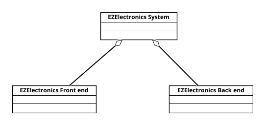
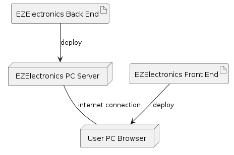

# EZElectronics

EZElectronics, read EaSy Electronics, is a web application for managing and selling electronic products. The project describes an online store where customers can browse the product catalog, manage a shopping cart, complete purchases, view previous orders, and interact with products through reviews or ratings. At the same time, managers can maintain the catalog, register new arrivals, update stock, handle sales, and monitor the state of the store.

## Program Summary

The system is centered around three main user roles:

- **Customers**, who use the website to search products, add items to the cart, checkout, view cart history, manage personal information, and provide feedback on products or issues.
- **Managers**, who are responsible for catalog and inventory operations, including product creation, deletion, quantity updates, new arrivals, and sales confirmation.
- **Admins**, who supervise user management, reports, permissions, and system support activities.

The core application features are:

- **Catalog management**: products can be created, modified, removed, filtered by category or model, and associated with arrivals and stock changes.
- **Account management**: users can register, log in, log out, view their profile, delete their account, recover passwords, and update personal data.
- **Cart and purchase flow**: customers can add products to the current cart, remove items, clear the cart, pay for the current cart, and inspect past carts.
- **User management**: managers and admins can list users, filter them by role, retrieve user details, delete accounts, block users, and inspect user reports.
- **Product feedback and support**: customers can rate products, create issue reports, save favorites, manage privacy settings, and configure payment methods.
- **Order management**: customers can view order status, access invoices or receipts, and track deliveries.

## Application Screenshots

| Login | Customer home | Shop |
| --- | --- | --- |
|  |  |  |

| Current cart | Order history | Manager stock |
| --- | --- | --- |
|  |  |  |

| Manager home | Admin home | User management |
| --- | --- | --- |
|  |  |  |

## Diagrams

| Use case diagram | System design | Deployment |
| --- | --- | --- |
|  |  |  |

## Project Documents

The repository contains the main documents used to describe, design, estimate, test, and deploy the application:

- [RequirementsDocumentV1.md](./RequirementsDocumentV1.md): describes the initial version of EZElectronics used as the starting point for the project.
- [RequirementsDocumentV2.md](./RequirementsDocumentV2.md): describes the final solution, including administration, checkout, orders, privacy, ads, reports, and product interaction features.
- [OfficialRequirementsDocumentV1.md](./OfficialRequirementsDocumentV1.md): official reference for the first requirement version.
- [OfficialRequirementsDocumentV2.md](./OfficialRequirementsDocumentV2.md): official reference for the final requirement version.
- [API.md](./API.md): API specification for the backend services.
- [GUIPrototypeV1.md](./GUIPrototypeV1.md): first version of the graphical user interface prototype.
- [GUIPrototypeV2.md](./GUIPrototypeV2.md): final version of the graphical user interface prototype.
- [EstimationV1.md](./EstimationV1.md): initial project effort estimation.
- [EstimationV2.md](./EstimationV2.md): updated project effort estimation.
- [TimeSheet.md](./TimeSheet.md): work log and time tracking for the project.
- [TestReport.md](./TestReport.md): testing strategy, executed tests, and test results.
- [CHANGELOG.md](./CHANGELOG.md): summary of relevant project changes.
- [deploy/README.md](./deploy/README.md): deployment instructions for running EZElectronics with Docker and nginx.
